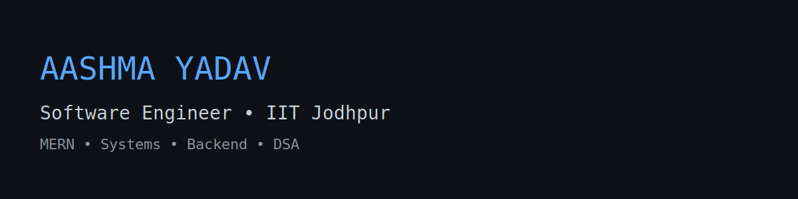
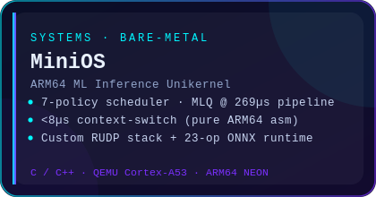
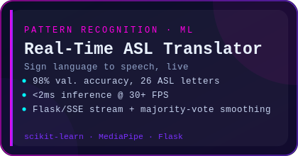
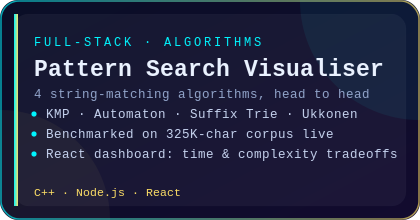
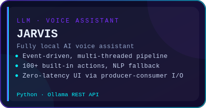
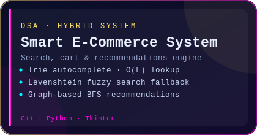
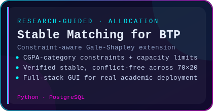

<div align="center">

<picture>
  <source media="(prefers-color-scheme: dark)" srcset="assets/banner.svg">
  <source media="(prefers-color-scheme: light)" srcset="assets/banner-light.svg">
  
</picture>

<br>

<a href="https://www.linkedin.com/in/aashma-yadav">
  
</a>
<a href="mailto:aashmaydv1810@gmail.com">
  
</a>
<a href="https://github.com/aashma-yadav">
  
</a>


<br><br>

<a href="https://github.com/aashma-yadav">
  
</a>

</div>

<br>

## `whoami`

```yaml
name:      Aashma Yadav
role:      Computer Science & Engineering, B.Tech @ IIT Jodhpur
focus:     [ DSA , Operating Systems, ARM64/Systems Programming, Machine Learning ]
currently: Pursuing projects on MERN STACK
learning:  AI agents, Model Context Protocol, distributed systems
reach_me:  aashmaydv18@gmail.com
```

- **Systems** — bare-metal unikernels, cooperative schedulers, custom transport protocols, ARM64 assembly
- **Machine Learning** — pattern recognition, real-time inference pipelines, surrogate modelling for engineering optimization
- **Full-Stack** — React / Node.js / Flask / PostgreSQL, building the product end of research and DSA projects
- Oracle Certified Foundations Associate — **Agentic AI** (LangChain · MCP · autonomous agent architectures)

<br>

## Stack

<div align="center">


</div>

<br>


### Activity graph

<div align="center">

<picture>
  <source media="(prefers-color-scheme: dark)" srcset="https://github-readme-activity-graph.vercel.app/graph?username=aashma-yadav&theme=react-dark&bg_color=0A0E27&color=00F6FF&line=7B2FFF&point=FF00E5&hide_border=true">
  <source media="(prefers-color-scheme: light)" srcset="https://github-readme-activity-graph.vercel.app/graph?username=aashma-yadav&theme=minimal&hide_border=true">
  
</picture>

</div>

### Isometric contribution calendar

<div align="center">


<sub>Generated on a schedule by <code>.github/workflows/metrics.yml</code> — see setup notes below.</sub>

</div>

### Achievements

<div align="center">


</div>

<br>

## The snake eats the commit graph

<div align="center">

<picture>
  <source media="(prefers-color-scheme: dark)" srcset="https://raw.githubusercontent.com/aashma-yadav/aashma-yadav/output/snake-dark.svg">
  <source media="(prefers-color-scheme: light)" srcset="https://raw.githubusercontent.com/aashma-yadav/aashma-yadav/output/snake.svg">
  
</picture>

</div>

<br>

## Featured builds

<div align="center">
<table border="0" cellspacing="12" cellpadding="0">
<tr>
<td><a href="[https://github.com/aashma-yadav](https://github.com/aashma-yadav/MiniOS.git)"></a></td>
<td><a href="[https://github.com/aashma-yadav](https://github.com/aashma-yadav/asl-sign-language-translator.git)"></a></td>
</tr>
<tr>
<td><a href="[https://github.com/aashma-yadav](https://github.com/aashma-yadav/Efficient-Text-Searching.git)"></a></td>
<td><a href="[https://github.com/aashma-yadav](https://github.com/aashma-yadav/JARVIS.git)"></a></td>
</tr>
<tr>
<td><a href="[https://github.com/aashma-yadav](https://github.com/aashma-yadav/DSA_Project.git)"></a></td>
<td><a href="[https://github.com/aashma-yadav](https://github.com/aashma-yadav/btp-allocation-system.git)"></a></td>
</tr>

</table>
</div>


<br>

## Research

**Reliability-Based Design Optimization of Offshore Wind Turbine Structures**
*Under the guidance of Dr. Monika Tanwar · Conference Paper · Sep 2025 – Dec 2025*
RBF surrogate modelling for RBDO of 5MW offshore monopiles across six limit states, PSO-driven with 15,000-sample Monte Carlo — **8.4% material reduction** at β<sub>sys</sub> = 3.18, with a **180× speedup** over direct FEA.

<br>


